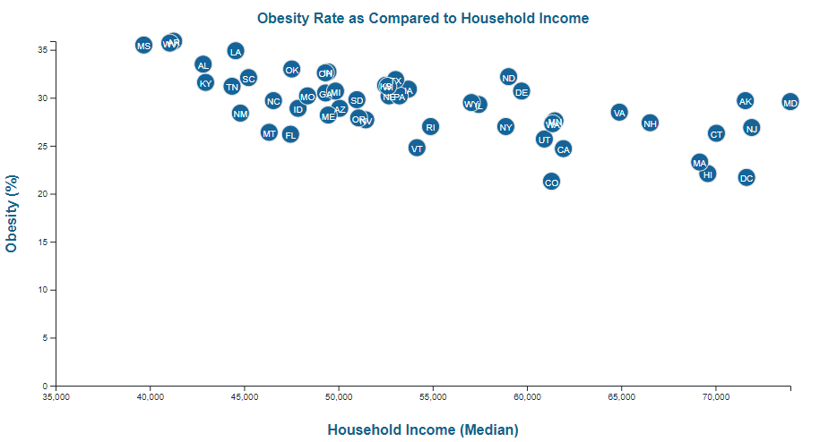

# D3-Challenge
## D3 Times Publication

This assignment included analyzing the current trends shaping people's lives, and then creating an interactive graph to help readers understand my findings.

The data set included with this assignment is based on 2014 ACS 1-year estimates from the US Census Bureau. The current data set includes data on rates of income, obesity, poverty, etc. by state. I chose to create a graph showing obesity as it compares to the median household income in all 50 states. The graph is interactive in that you can click on each cirlcle and a pop-up will show the obesity percent and the median household income for each state. The graph is shown below:

